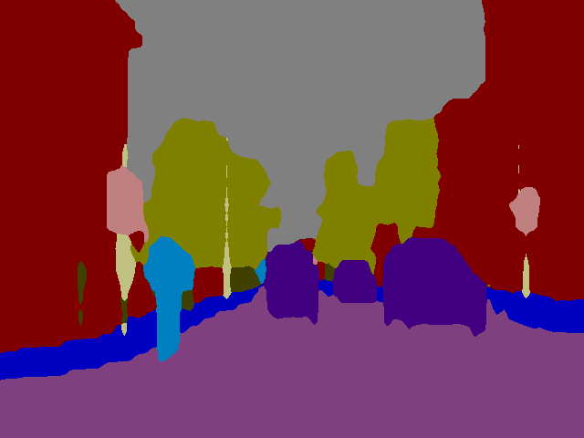

# dilation-tensorflow
A native *Tensorflow* implementation of semantic segmentation according to [Multi-Scale Context Aggregation by Dilated Convolutions](https://arxiv.org/abs/1511.07122) by Yu and Koltun.

Pretrained weights have been converted to TensorFlow from the [original Caffe implementation](https://github.com/fyu/dilation).

Currently, only the model pretrained on CityScapes is available. I plan to convert soon also the model trained on CamVid dataset.

You you're looking instead for a *Keras+Theano* implementation of this very same network you can find it [here](https://github.com/DavideA/dilation-keras).

## Examples

### Cityscapes

<table style="width:100%">
  <tr>
    <th>
      

           
            Test image (input)
      

    </th>
        <th>
          

           
            Test image (prediction)
        

    </th>
    </tr>
</table>

### CamVid

<table style="width:100%">
  <tr>
    <th>
      

           
            Test image (input)
      

    </th>
        <th>
          

           
            Test image (prediction)
        

    </th>
    </tr>
</table>

## How-to
1. Download pretrained weights from here:

    [CityScapes weights](https://drive.google.com/open?id=0Bx9YaGcDPu3XR0d4cXVSWmtVdEE)
    
    [CamVid weights](https://drive.google.com/open?id=0Bx9YaGcDPu3Xd0JrcXZpTEpkb0U)
    
2. Move weights file into [`data`](data) directory.

3. Run the model on the test image by executing [`main_tf.py`](main_tf.py).

## Configuration

This model has been tested with the following configuration:
- Ubuntu 16.04
- python 3.5.2
- tensorflow 1.1.0
- cv2 3.2.0
  
  
